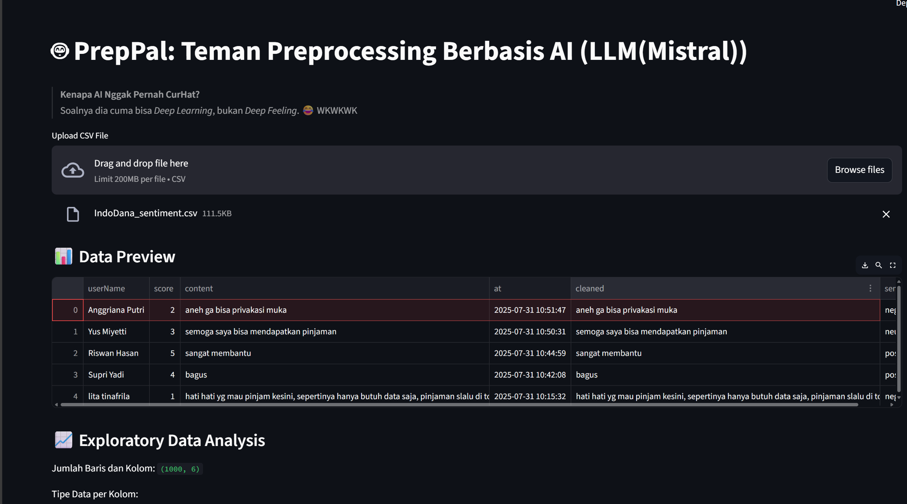
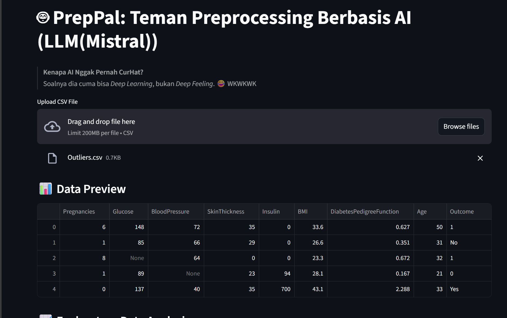
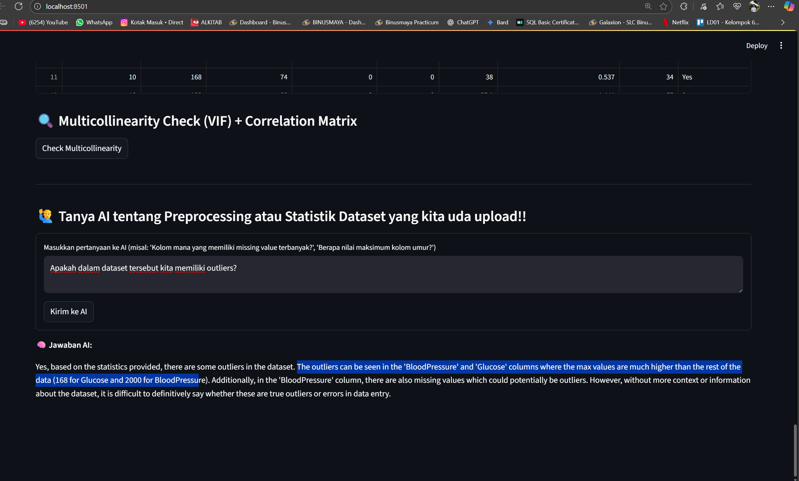
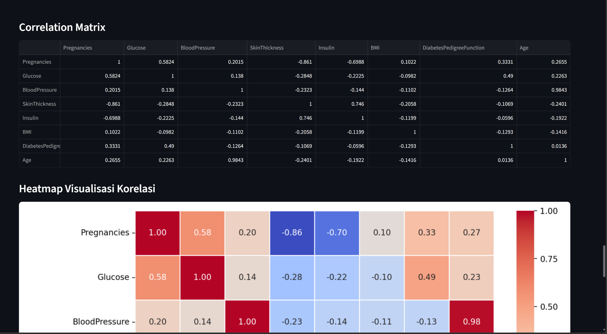

# 🤖 PrepPal – AI-Powered Automated Preprocessing Assistant

  

  

  

I'm really curious about building an automatic preprocessing system to help me with simple dataset preprocessing — and that's how I created **PrepPal**.

PrepPal is a simple and powerful web-based application built using **Streamlit**, designed to **automate common preprocessing tasks** on datasets and make them ready for **Machine Learning integration**.  
It also integrates an **AI assistant powered by Mistral** via **LangChain** (*right now still running **Locally**), allowing users to query and analyze their uploaded datasets in natural language.

  

---

## 🚀 Project Objective

The main goal of PrepPal is to **simplify and automate common preprocessing steps** for users working with datasets. This tool helps handle:

- 🔍 Missing values  
- 📄 Duplicate entries  
- 📈 Outliers  
- 🔤 Unstandardized data  
- 🏷️ Categorical variables  
- 🧠 **Natural language-based data exploration with LLM**

By streamlining this process, PrepPal saves valuable time and ensures your dataset is **machine-learning-ready** in just a few clicks.

---

  

## ⚙️ Features

Here are the core features of **PrepPal**:

- 📤 **Upload CSV File**  
  - Upload dataset in `.csv` format (Max size: **200MB**)

- 📊 **Initial EDA (Exploratory Data Analysis)**  
  - Dataset summary using `.describe()`  
  - Visual distribution (Bar chart) of all columns  

- 🧹 **Preprocessing Functions**:
  - ✅ **Missing Values**  
    - Detect and handle missing values (drop or impute)
  - 🔁 **Duplicate Values**  
    - Detect and remove duplicates  
  - 📌 **Outliers Detection**  
    - Detect and optionally remove or replace outliers
  - 🧮 **Categorical Data Handling**  
    - Apply `LabelEncoder` to categorical columns  
  - 📏 **Standardization**  
    - Standardize numerical data using `StandardScaler`  
  - 🧠 **Multicollinearity Check**  
    - VIF (Variance Inflation Factor) calculation  
    - Correlation Matrix + Heatmap visualization  

- 🧠 **AI Assistant (LLM via Mistral + LangChain)**  
  - Ask questions about your uploaded dataset using natural language  
  - Analyze, summarize, or explore data insights automatically  
  - Powered by **LangChain framework** and **Mistral LLM** backend  

- 📥 **Download Final Dataset**  
  - Download the cleaned and preprocessed dataset for further Machine Learning workflows or for storage  

---

  

## 📂 How to Use

1. Upload your dataset (CSV format, max 200MB)
2. Explore your data using summary and visualizations
3. Let PrepPal handle preprocessing steps automatically
4. Ask AI questions about your dataset (optional)
5. Download the final processed dataset

---

## 📌 Notes

- Built with **Python**, **Streamlit**, **Pandas**, and **LangChain**
- Powered by **Mistral LLM** for intelligent data Q&A
- Intended for **educational**, **research**, and **rapid prototyping** use cases  
- Does not currently support multi-file or non-CSV formats

---

## 🙌 Contribution

Feel free to fork this repository and submit pull requests. Feedback and improvements are highly welcome!

---

## 📃 License

This project is licensed under the MIT License.
